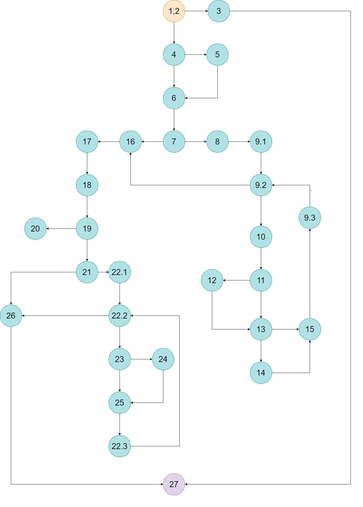
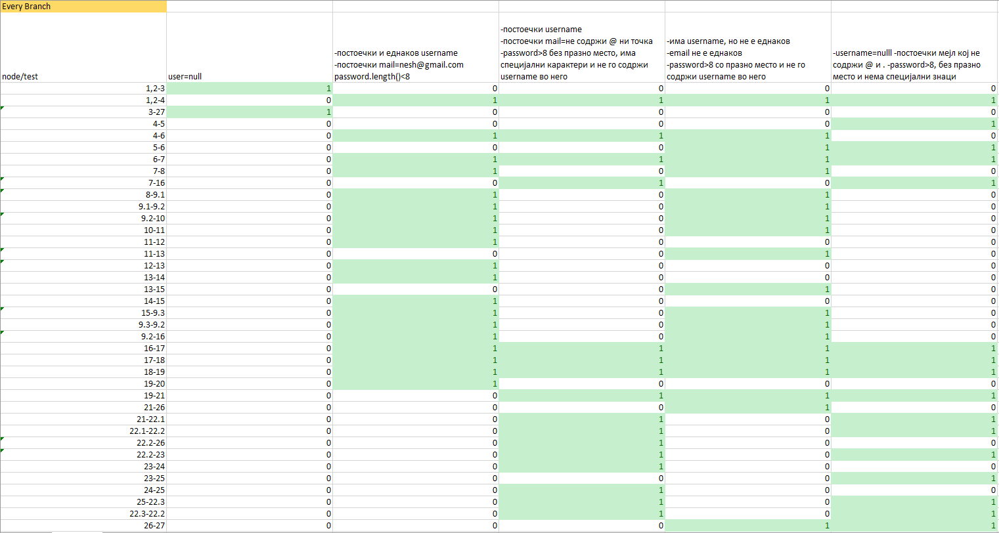
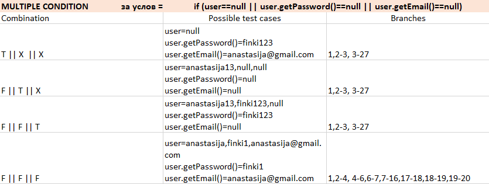

# Втора лабораториска вежба по Софтверско инженерство
## Анастасија Димовска, 213262

### Control Flow Graph

### Цикломатска комплексност
Цикломатската комплексност е 11. Овој резултат го добив според формулата P + 1, така што P е бројот на предикатни јазли што изнесува 10 и додадов + 1. 

### Every Branch

Со помош на Every Branch методата пишуваме тест примери колку што ни се потребни за нашиот код да се посетат сите јазли. Во овој случај, потребни ни се 5 тест примери:
1. username да биде null
2. Имаме постоечки и еднаков username и исто така постоечки 
mail кој содржи @ и . во него. Големината на лозинката е помала од 8.
3. Имаме постоечки username и исто така постоечки 
mail кој не содржи @ и . во него. Големината на лозинката е поголема од 8, содржи специјални карактери и не содржи дел (или цел) username во неа.
4. Има username и mail, кои што не се еднакви. Големината на лозинката е поголема од 8, не содржи дел (или цел) username во неа и има празно место.
5. username е null, големината на лозинката е поголема од 8 и не содржи специјални знаци во неа.

### Multiple Condition

Multiple condition методата ни служи за евалуација на сите јазли во кои што се врши одлучување и во двете можни насоки, односно ако е true и ако е false. Според тоа, за условот  if (user==null || user.getPassword()==null || user.getEmail()==null) потребни ни се 4 тест случаи како што е прикажано на сликата, и тоа:
1. T || X || X каде што user ќе има вредност null, а лозинката и мејлот може да имаат било каква вредност
2. F || T || X каде што user нема да биде null, лозинката ќе биде null, а мејлот може да има било каква вредност
3. F || F || T каде што user и лозинката нема да имаат вредност null, а мејлот ќе има вредност null
4. F || F || F каде што ни user ни лозинката ни мејлот нема да имаат вредност null

### Unit tests

Со помош на Unit тестовите се прават тестирања на делови од кодот со цел да се потврди дека секоја единица од кодот работи така како што се очекува. Во овој случај напишав тестови со помош на претходните прашања, каде што преку табели ги тестирав тест случаите за методите Every Branch и Multiple Condition. Во една функција ги напишав тестирањата на сите тест случаи како кај Every Branch, а во друга функција ги напишав сите тестирања за Multiple Condition. Пред секоја функција имам напишано коментар кој се однесува на тоа кој тест случај е тестиран. Исто така, функциите за тестирање имаат посебна анотација @Test која стои пред функцијата. 

